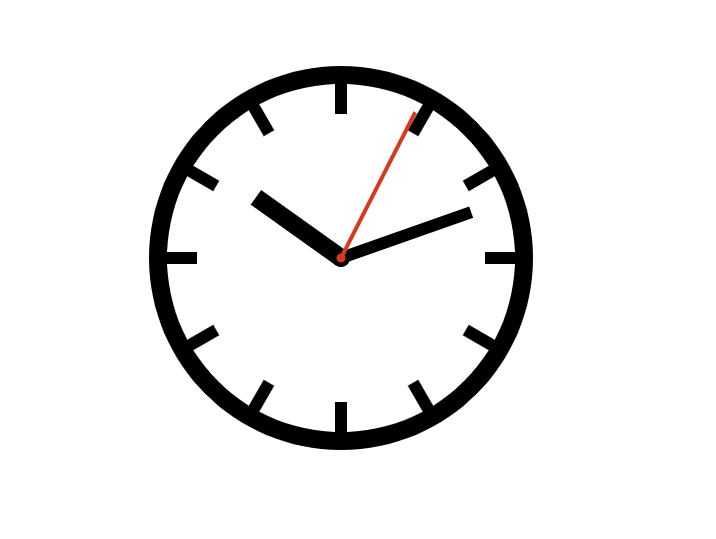
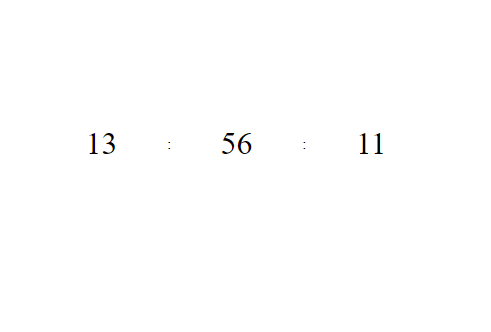

# Clock

A simple web-based clock built using **HTML**, **CSS**, and **TypeScript**. The project uses Parcel as the bundler for development and production builds.




## Features

- The first app is just a clock phase with the second, minute and hour hands.
- It re-adjusts to the current time of user's browser.
- It automatically increments to show correct time, **All three arms adjust angle**
- The second one is a simple digital clock with numeric values that adjust based on change in time.
- Both apps use the **Date** class in javcascript.

## Technologies Used

- HTML: Structure of the application.
- CSS: Styling the app layout.
- TypeScript: Logic for handling angle change with change in time.
- Parcel: Bundler for building and serving the app in development.

## Getting Started

### Prerequisites

Make sure you have Node.js installed on your machine. You can download it from here.

### Installation

1. Clone the repository.

   ```bash
   git clone https://github.com/opaque-maniac/clock.git
   ```

2. Navigate to the project directory.
   ```bash
   cd clock
   ```
3. Install dependencies.
   ```bash
   npm install
   ```

### Running the app in development

To run the clock in development mode with live reloading, use the following command:

To start the digital clock, run:

```bash
npm run start-digital
```

To start the analogue clock, run:

```bash
npm run start-analogue
```

The app will run on [localhost](http://localhost:1234)

If the port is different, **check the terminal**.

## Project Structure

```
clock/
│
│
├── src/                 # Source code
|   |── Digital             # Digital app code
|   |  ├── scripts/         # TypeScript logic
|   |  │   └── index.ts     # Main TypeScript file
|   |  ├── styles/          # CSS files
|   |  │   └── styles.css   # Main CSS file
|   |  └── index.html       # Main HTML file
│   |
|   └── Analogue            # Analogue app code
|      ├── scripts/         # TypeScript logic for
|      │   └── index.ts     # Main TypeScript file
|      ├── styles/          # CSS files
|      │   └── styles.css   # Main CSS file
|      └── index.html       # Main HTML file
│
├── package.json         # Project configuration and dependencies
├── tsconfig.json        # TypeScript configuration
├── .gitignore           # Git ignore file
└── README.md            # Project README file
```
